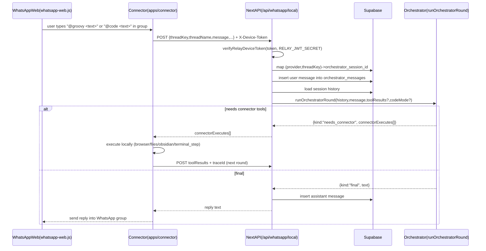

## Groovy source, licensing, and GitHub operations

This repo now follows the source-available licensing/distribution model in
`docs/groovy-licensing-distribution-plan.md` and
`docs/github-source-workflow.md`. Before launch/deployment work, also check
`docs/groovy-launch-readiness.md` for the external setup checklist and known
credential/account blockers.

### Repository roles

- `Charlesmendez/groovy` is the private source-of-truth repo. Keep it private.
  It is the current production source, Vercel deployment repo, paid source
  snapshot source, and internal development repo.
- `Charlesmendez/groovy-public` is the delayed public source-available mirror.
  Public issues and public pull requests belong there. It is not the current
  paid source and must not be treated as the development trunk.
- `Charlesmendez/groovy-releases` is the connector/release artifact repo for
  signed installers, headless connector tarballs, checksums, and CI-produced
  artifacts. It is not the licensing or payment system.

### Datagran account requirement

Groovy Memory and Datagran-backed Data Integrations require a Datagran account
when those features are enabled. Future setup docs, README changes, and CLI
flows must make this explicit.

Required env names:

- `DATAGRAN_API_KEY`
- `DATAGRAN_CHAT_MODEL`

If `DATAGRAN_API_KEY` is missing, treat memory as disabled and Datagran
integrations as unavailable until configured.

### npm CLI publishing

The publishable CLI package is `packages/groovy-cli` and the intended npm
package name is `@gogroovy/cli`.

Publishing requires:

- an npm account with access to the `@gogroovy` npm organization
- a private `groovy` GitHub Actions secret named `NPM_TOKEN`

Use an npm automation token or granular access token scoped to publish
`@gogroovy/cli`. Do not use a broad personal npm token if a narrower token is
available.

Publish with a CLI tag:

```bash
git tag -a cli-v0.2.1 -m "Publish Groovy CLI v0.2.1"
git push origin cli-v0.2.1
```

or run **Publish Groovy CLI to npm** manually from GitHub Actions.

### Source snapshot tags

Use dedicated source snapshot tags in the private `groovy` repo:

```bash
git tag -a source-v1.2.3 -m "Paid source snapshot v1.2.3"
git push origin source-v1.2.3
```

The public mirror workflow only auto-selects tags matching `source-v*`.
Do not use connector artifact tags like `v0.2.0` for public source mirroring;
connector tags are for release artifacts and could publish the wrong source if
used as mirror inputs.

Recommended release rhythm:

1. Merge current work into private `groovy`.
2. Run verification (`npm run lint`, `npx tsc --noEmit --pretty false`,
   `npm run build` when frontend/server code changed).
3. Create a paid source snapshot tag: `source-vX.Y.Z`.
4. Upload/generate paid source snapshots and release metadata through the
   portal/CLI flow.
5. Let `.github/workflows/publish-public-mirror.yml` publish that tag to
   `groovy-public` after the configured delay, currently 90 days.

### Public mirror updates

Automation lives in:

- `.github/workflows/publish-public-mirror.yml`
- `scripts/publish-public-mirror.mjs`

Scheduled behavior:

- Runs weekly from private `groovy`.
- Finds the newest `source-v*` tag older than 90 days.
- Publishes it to `Charlesmendez/groovy-public`.
- Exits without publishing if no eligible tag exists.

Manual behavior:

1. Open private `groovy` on GitHub.
2. Go to **Actions**.
3. Run **Publish Public Mirror**.
4. Optionally set:
   - `source_ref=source-vX.Y.Z`
   - `delay_days=90`
   - `tag_pattern=source-v*`
   - `target_repo=Charlesmendez/groovy-public`

The workflow uses the private repo secret `PUBLIC_MIRROR_SSH_KEY`, whose public
half is a write deploy key on `groovy-public`.

### Public contributions

Public contributors work against `groovy-public`.

Allowed public contribution types:

- docs
- examples
- SDKs
- small fixes
- tests that apply to the delayed source
- security reports through `SECURITY.md`

Never automatically merge `groovy-public` back into private `groovy`.
To accept a public PR:

1. Review the public PR in `groovy-public`.
2. Pull the specific patch or cherry-pick the specific commit locally.
3. Apply it to private `groovy`.
4. Resolve conflicts against current private source.
5. Run verification.
6. Merge through private `groovy`.
7. Let the accepted change appear in `groovy-public` later through the delayed
   mirror workflow.

### Paying customer source access

Personal paid users should get current source through the Groovy portal/CLI
source snapshot flow, not private GitHub collaborator access.

Enterprise customers should also get source through portal/CLI snapshots by
default. Private GitHub collaborator access is only for enterprise contracts
that explicitly include it.

Optional enterprise GitHub invite automation:

- Set `GITHUB_SOURCE_REPO=Charlesmendez/groovy`.
- Set `GITHUB_SOURCE_ACCESS_TOKEN` to a fine-grained GitHub token with access
  only to invite collaborators to the private source repo.
- Use `POST /api/admin/source-access/github` with a Groovy admin account to
  invite a customer GitHub username with `pull` permission.

Do not put a broad personal GitHub token in Vercel for this.

## WhatsApp agent (local) - implementation notes (current)

This repo adds a **local WhatsApp Web bridge** that lets you run the existing **Orchestrator** and a **real interactive Claude Code relay** from a WhatsApp group, **without** Meta Cloud / Twilio.

It works by running a **local connector** on the user’s Mac (WhatsApp Web automation) that forwards messages into the Flow app via API routes. The server runs the orchestrator and can request **connector-executed tools** (browser/files/obsidian + Claude Code PTY steps).

---

## High-level flow



Key properties:
- **Session persistence** is the same as the dashboard: all messages are stored in `orchestrator_messages` under an `orchestrator_sessions` row.
- The only new piece is mapping a WhatsApp “thread” to an orchestrator session.
- **Auth** does **not** use browser cookies. It uses the connector’s existing **relay-issued `device_token`**, verified server-side.
- **Claude Code in WhatsApp is interactive**: the orchestrator drives an ongoing local PTY session (not `claude -p`).

---

## Server-side pieces (Flow app)

### 1) Session mapping table
Migration: `supabase/migrations/20260126010000_orchestrator_external_threads.sql`

Creates:
- `public.orchestrator_external_threads`
  - `(user_id, provider, thread_key) -> orchestrator_session_id`
  - RLS: user can only read/write their own rows

This is what makes WhatsApp “sessions” work:
- Default: **one long-lived session per WhatsApp group**
- Command `@groovy new`: creates a new `orchestrator_sessions` row and updates the mapping

### 2) Device-token authentication
File: `src/lib/relay/deviceToken.ts`

`verifyRelayDeviceToken(token, RELAY_JWT_SECRET)` validates the relay JWT HMAC signature and returns:
- `userId`
- `deviceId`

This is used by the WhatsApp API route so we can call the orchestrator **without Supabase cookie auth**.

Env needed in the Next app:
- `RELAY_JWT_SECRET` (same secret the relay uses to mint/verify device tokens)
- `SUPABASE_SERVICE_ROLE_KEY` and `NEXT_PUBLIC_SUPABASE_URL` (admin client usage)

### 3) WhatsApp API route (the bridge entrypoint)
File: `src/app/api/whatsapp/local/route.ts`

Request:
- Header: `X-Device-Token: <device_token>`
- Body:
  - `provider` (defaults to `whatsapp_web`)
  - `threadKey` (stable id from WhatsApp Web)
  - `threadName`
  - `message` (first round only)
  - `command: "new"` (optional)
  - `mode: "orch" | "code"` (optional; `code` enables Claude Code relay)
  - `code: { terminalId, workspaceRootPath }` (required when `mode:"code"`)
  - `toolResults[]` + `traceId` (for continuation rounds after local tool execution)

Behavior:
- Verifies device token
- Maps `threadKey` -> `orchestrator_session_id` (creates if missing)
- Inserts message into `orchestrator_messages`
- Loads history and calls `runOrchestratorRound`
- Returns one of:
  - `kind: "final"` with `reply`
  - `kind: "needs_connector"` with `connectorExecutes[]`
  - `kind: "ui_open_code"` (WhatsApp tells you to use `@code`)
  - `kind: "browser_task"` (not supported in WhatsApp yet)

Notes:
- `final.reply` is truncated server-side for WhatsApp safety (~3500 chars) and persisted that way (so dashboard doesn’t show huge blobs).
- For progress: server returns an emoji-free `statusMessage` on `needs_connector` (e.g. `"Working in Claude Code..."`).

### 4) Single-step orchestrator runner for connector round-trips
File: `src/lib/orchestrator/runOrchestratorRound.ts`

This is the core enabler of WhatsApp/connector loops:
- It runs the orchestrator for **exactly one tool step** (`stopWhen: stepCountIs(1)`).
- It parses tool results for:
  - `__connector_execute__` → returns `kind:"needs_connector"` with `connectorExecutes[]`
  - `__ui_open_code__` → returns `kind:"ui_open_code"`
  - `__browser_task__` → returns `kind:"browser_task"`
- If there are no connector executes, it returns `kind:"final"` with the assistant text.

This mirrors the dashboard’s “round” model but returns JSON rather than SSE.

WhatsApp `@code` relay details:
- `mode:"code"` forces the orchestrator into **code-mode prompting** and exposes a connector tool `code_terminal_step`.
- `code_terminal_step` becomes a connector execute `{ connectorType:"terminal_step", ... }` so the connector can talk to the local Claude Code PTY.

### 5) Heartbeat-embedded inbox weighted triage (no separate loop)
Files:
- `src/lib/heartbeat/runHeartbeat.ts`
- `src/lib/inbox/actions.ts`

This is embedded directly in the existing hourly heartbeat run (not a second scheduler).

Data collection inside heartbeat:
- Heartbeat fetches Gmail per connected mailbox (multi-mailbox) with:
  - `q=in:inbox -from:me newer_than:1d`
- It builds one merged triage set and calls:
  - `runInboxTriageForHeartbeat(...)`

Scoring model (Stage A deterministic weights):
- Each email gets three probabilities:
  - `p_important`
  - `p_spam`
  - `p_actionable`
- Inputs include:
  - sender affinity cache (`incomingCount`, `repliedCount`, last interaction)
  - sender intel cache (domain reputation from web lookup with 8s timeout)
  - recipient size/directness
  - urgency/ask/marketing/list-unsubscribe signals
- Initial action mapping:
  - high spam -> `mark_spam` / `unsubscribe`
  - high important+actionable -> `draft_reply`
  - low important + low spam -> `archive`
  - else -> `label_processed`

Stage B escalation (LLM with full content):
- If Stage A is ambiguous/low-confidence or critical-but-uncertain, heartbeat fetches:
  - full Gmail message body
  - thread summary
- Then `runStageBPolicy(...)` re-scores and can change action/confidence/draft.

Action execution in same heartbeat run:
- `draft_reply`: pre-creates Gmail draft (+ `Groovy/Drafted` label when creation succeeds)
- `mark_spam`: applies spam + Groovy labels
- `unsubscribe`: applies `Groovy/Unsubscribed` + processed labels (URL execution handled locally via connector when approved)
- `archive` / `label_processed`: label/archive actions

Auto-execution policy:
- `draft_reply` -> never auto
- `unsubscribe` -> never auto
- `mark_spam` -> auto only if confidence `>= 0.93`
- `archive` -> auto only if confidence `>= 0.88`
- Others follow default auto behavior

Heartbeat output behavior:
- If model returns `__SKIP__` but inbox triage produced pending/auto actions, heartbeat sends an inbox triage update anyway.
- Pending actions are bound to the heartbeat `session_id`.
- Heartbeat appends a numbered command block from `buildHeartbeatActionBlock(...)`, with draft previews and commands like:
  - `approve 1`
  - `edit 1: ...`
  - `reject 1`
- It also appends autopilot summary (e.g., low-risk auto-processed count).
- Counts are persisted in `orchestrator_messages.metadata`:
  - `inbox_pending_count`
  - `inbox_auto_executed_count`
  - `inbox_critical_count`

### 6) Aiyra / OpenClaw per-user key handling (dashboard + voice bootstrap)
Files:
- `src/app/api/aiyra/config/route.ts`
- `src/app/api/aiyra/device-session/route.ts`
- `src/lib/supabase/server.ts`
- `src/lib/crypto/llmKey.ts`

How user identity is resolved:
- Web/dashboard requests to `GET /api/aiyra/config` use the normal **Supabase cookie session**.
- `createSupabaseServerClient()` reads request cookies and `supabase.auth.getUser()` resolves the current `user.id`.
- Connector wake/bootstrap requests to `POST /api/aiyra/device-session` do **not** use browser cookies; they use `X-Device-Token`, verified via `verifyRelayDeviceToken(...)`, which yields `userId` + `deviceId`.

How the per-user Aiyra key is stored:
- Each user's provider key is stored in `public.user_aiyra_settings.api_key_enc` (plus `api_key_hash`), not in plaintext.
- When the user saves a key in Settings, the browser sends it once to `POST /api/aiyra/config`.
- Server encrypts it with `encryptLlmApiKey(...)`; encryption/decryption is backed by `LLM_KEY_ENCRYPTION_KEY` on the Next server.

How settings/defaults are loaded:
- Settings page calls `GET /api/aiyra/config`; the browser does **not** need to resend the raw provider key if one is already saved.
- Server resolves the current user from the Supabase session cookie, loads + decrypts `api_key_enc`, then calls upstream OpenClaw/Aiyra `POST /api/aiyra/config` with `autoLoadOnly: true`.
- The upstream response is merged with local UI fields (wake word, wake sensitivity, idle timeout, enabled flag) and returned to the browser.
- If no stored key exists, the route returns local-only defaults instead of attempting an upstream fetch.

How Aiyra voice bootstrap works:
- Connector wake flow calls `POST /api/aiyra/device-session` with `X-Device-Token`; connector does **not** need the raw provider key.
- Server verifies the device token, resolves the user, loads + decrypts that user's saved key, then calls upstream OpenClaw/Aiyra endpoints such as:
 - `POST /api/session/config/auto`
 - `POST /api/auth/ws-ticket`
- Connector receives `wsUrl`, `conversationId`, `orchestratorSessionId`, etc. The raw Aiyra/OpenClaw key stays server-side.

Env vars and what they mean:
- `NEXT_PUBLIC_SUPABASE_URL` + `NEXT_PUBLIC_SUPABASE_ANON_KEY`: let web routes resolve the logged-in Supabase user from cookies.
- `LLM_KEY_ENCRYPTION_KEY`: encrypts/decrypts stored per-user provider keys on the server.
- `AIYRA_BASE_URL` / `OPENCLAW_BASE_URL`: upstream OpenClaw/Aiyra host. This selects the upstream service; it does **not** identify the user.
- `RELAY_JWT_SECRET`: required for the connector/device-token auth path (`/api/aiyra/device-session`), not for dashboard cookie auth.

Security model:
- User identity comes from the Supabase session cookie (web) or verified relay `device_token` (connector), not from env vars.
- Raw Aiyra/OpenClaw key should only be sent from the browser when initially saving/replacing it.
- Normal config loads and live voice bootstraps reuse the encrypted server-side copy.
- Do not return decrypted provider keys to the client or persist them on the connector.

---

## Connector-side pieces (local Mac app)

### 1) WhatsApp automation
File: `apps/connector/whatsapp.mjs`

What it does:
- Launches WhatsApp Web via `whatsapp-web.js` (uses Puppeteer under the hood) using a persistent session dir:
  - `~/.groovy/whatsapp-web-session`
- Opens the target group by **name** (`WHATSAPP_GROUP_NAME`, recommended “Groovy”)
- Listens for messages and reacts to:
  - `@groovy <text>` → Orchestrator mode
  - `@groovy new` → new orchestrator session mapping
  - `@code <text>` → Claude Code relay mode (orchestrator-driven)
  - `@code new` / `@code setup` → creates/rotates a Code session mapping and selects workspace

Round-trip execution:
- For orchestrator messages it calls `POST {GROOVY_APP_URL}/api/whatsapp/local`
- If response is `needs_connector`, it executes each `connectorExecute` locally via `executeConnectorRpc()` and posts `toolResults` back (up to 12 rounds).

Progress updates (WhatsApp UX):
- Emoji-free timed pings across the entire multi-round job:
  - `Still working…` (10s)
  - `Still working (almost there)…` (25s)
  - `Still working (taking longer than usual)…` (45s)
- Also sends the server-provided `statusMessage` once per request (emoji-free).

Welcome message:
- A welcome message is sent **once per threadKey** and persisted to:
  - `~/.groovy/whatsapp-bridge.json`

Window sizing:
- Puppeteer is launched with:
  - `--window-position=0,0`
  - `--window-size=1650,1050`
  - `defaultViewport: null`

### 2) Connector single-instance / kill others
File: `apps/connector/connector.mjs`

Problem:
- macOS LaunchAgent auto-start can race a manual run, causing the “single instance lock” to exit immediately.

Fix:
- `--kill-others` now terminates the PID found in the lock file **before** exiting, then acquires the lock.
- This allows manual runs like:
  - `node connector.mjs ... --whatsapp --kill-others`

### 3) Claude Code mode (WhatsApp `@code`)
File: `apps/connector/whatsapp.mjs`

This is the **interactive relay implementation** (not `claude -p`):
- Connector calls `POST /api/whatsapp/code` to get (or create) a **Claude Code session mapping** and retrieve a stable `terminalId`.
- Connector sends `@code <message>` to `POST /api/whatsapp/local` with `mode:"code"` + `{ terminalId, workspaceRootPath }`.
- Server orchestrator decides what to do and emits tool calls:
  - `code_terminal_step` → connector execute `{ connectorType:"terminal_step" }`
- Connector executes `terminal_step` by:
  - ensuring a PTY for `terminalId` (spawn shell + start interactive `claude --allowedTools 'All'`)
  - writing input to the PTY
  - waiting for output to go “quiet” (buffer stable)
  - returning `{ delta, tail }` (ANSI stripped)
- Orchestrator parses/summarizes output and replies to WhatsApp.

Env:
- `GROOVY_CODE_CWD` (or persisted config `code_cwd`) points to the repo/workspace to run Claude in.

### 4) Inbox approvals + local unsubscribe execution (new)

This extends conversational inbox approvals (`approve 1`, etc.) so unsubscribe actions can finish locally on the connector, without server-side URL fetches.

Shared behavior (web + WhatsApp):
- `executeInboxCommand` can now return `connectorExecutes[]` when an approved action is `recommended_action="unsubscribe"` and the email has `List-Unsubscribe` targets.
- The action is still archived/labeled server-side first (`Groovy/Unsubscribed` + `Groovy/Processed`).
- Then local execution is requested via connector type:
  - `connectorType: "email_unsubscribe_execute"`

Server/API flow:
- Web command route: `src/app/api/inbox-actions/command/route.ts`
  - Returns `kind:"needs_connector"` + `connectorExecutes[]` when local unsubscribe work is required.
- WhatsApp route: `src/app/api/whatsapp/local/route.ts`
  - Same `needs_connector` behavior for inbox commands.
  - Uses `completeAfterConnector: true` so WhatsApp can finish the command reply after local execution.
- Command construction: `src/lib/inbox/actions.ts`
  - Builds connector executes in `buildUnsubscribeConnectorExec(...)`.

Connector execution:
- Relay forwards `email_*` RPCs (`apps/relay/server.mjs`).
- Connector handlers:
  - `apps/connector/connector.mjs` (dashboard/web relay path)
  - `apps/connector/whatsapp.mjs` (WhatsApp loop path)
- Both execute `email_unsubscribe_execute` with strict guards.

Safety guardrails for unsubscribe URL execution:
- HTTPS only (`http` rejected).
- Blocks localhost / `.local` / single-label hosts.
- DNS resolution required; private/link-local/loopback IP targets are rejected.
- Redirects are bounded and re-validated each hop.
- Request timeout is bounded.
- If URL fails but `mailto:` exists, returns `mailto_prepared` fallback metadata (manual-send path), not blind retries.

Result semantics:
- Success:
  - `method: "url_post"` or `"url_get"` with status.
- Fallback success:
  - `method: "mailto_prepared"` when URL path fails but a mailto target exists.
- Failure:
  - Explicit error code returned in connector result and surfaced in command reply.

### 5) Aiyra voice (wake word + live voice session)
Files:
- `apps/connector/connector.mjs`
- `apps/connector/aiyraVoice.mjs`
- `apps/connector/rnnoise.mjs`
- `apps/connector/platform/aec/webrtc.mjs`
- `apps/connector/platform/wake/openwakeword_runner.py`
- `apps/connector/native/rnnoise-addon/*`

High-level runtime:
- Aiyra voice is a **local connector runtime**, not a browser feature. The connector owns:
  - wake-word listening
  - microphone capture
  - speaker playback
  - AEC / RNNoise / gain staging
  - websocket streaming to the app/server
- Startup config is resolved in `connector.mjs` and passed into `startAiyraVoiceRuntime(...)`.
- Runtime precedence is:
  - CLI args
  - env vars
  - local connector config (`~/.groovy/connector.json`)
  - later, dashboard-persisted config hydrated over relay (`connector_configure`)

Wake-word implementation:
- Default wake engine is `openwakeword` (`AIYRA_WAKE_ENGINE=openwakeword` or omitted).
- Porcupine still exists:
  - as an explicit engine (`AIYRA_WAKE_ENGINE=porcupine`)
  - or as an optional fallback if OpenWakeWord startup fails and `AIYRA_OPENWAKEWORD_ALLOW_PORCUPINE_FALLBACK=1`
- Wake capture uses `PvRecorder` at **16 kHz mono**.
- OpenWakeWord runs via a **Python sidecar**, not in-process JS:
  - runner: `apps/connector/platform/wake/openwakeword_runner.py`
  - connector sends PCM frames to the runner over stdio
  - runner emits detection JSON back to Node
- Model resolution order for OpenWakeWord:
  - explicit path / `AIYRA_OPENWAKEWORD_MODEL_PATH`
  - bundled model under `apps/connector/platform/wake/models/`
  - server download from `GET /api/aiyra/openwakeword-model?wakeWord=...`
  - cached model under `~/.groovy/openwakeword/*.onnx|*.tflite`
- If Python/OpenWakeWord deps are missing, the connector attempts automatic bootstrap and downloads OpenWakeWord resource models before retrying the runner.
- `AIYRA_OPENWAKEWORD_ALLOW_APPROXIMATE=1` allows nearest-model matching when there is no exact wake-word model.
- Wake loop has a cooldown (`wakeCooldownMs`) so repeated detections do not instantly retrigger a new session.

Wake-time RNNoise:
- Wake detection can denoise the microphone **before** handing frames to OpenWakeWord / Porcupine.
- This uses the same RNNoise wrapper as the live voice session.
- The wake recorder frame length is aligned to the **least common multiple** of:
  - detector frame size
  - RNNoise input frame size
- If wake-time RNNoise fails to initialize or process frames, wake detection continues without denoise instead of killing the runtime.

Voice session bootstrap:
- When wake fires, the connector calls `POST /api/aiyra/device-session` with `X-Device-Token`.
- Request body includes:
  - `channelMode: "mic_main"`
  - optional previous `conversationId` so the next turn can stay in the same conversation when possible
- Bootstrap response returns:
  - `wsUrl`
  - `conversationId`
  - optional `orchestratorSessionId`
  - optional `bindingMode`
- The connector then opens the websocket and starts a full duplex voice loop.

Assistant playback path:
- Assistant audio arrives as websocket audio deltas.
- Connector queues those PCM chunks to the local speaker (`@mastra/node-speaker`) at **24 kHz**.
- The same playback PCM is also pushed into the AEC render queue, so AEC sees the far-end reference the user is hearing.
- Playback has a small prime buffer / hold window to reduce underflow and avoid instantly reopening the mic while assistant audio is still draining.

Microphone send pipeline (actual order):
1. `PvRecorder` captures mono PCM at **16 kHz**.
2. If AEC is enabled and speaker playback exists, `createAecProcessor(...)` processes the capture frame against the playback render queue.
3. The AEC result then goes through RNNoise.
4. The RNNoise output then goes through capture gain compensation.
5. Half-duplex / playback hold logic decides whether the frame should be sent right now.
6. The final 16 kHz frame is upsampled to **24 kHz** and sent over websocket as `input_audio_buffer.append`.

AEC details:
- Current AEC backend is WebRTC AEC3 via `@ennuicastr/webrtcaec3.js`.
- The AEC processor tracks render-reference health using:
  - `idle`
  - `missing`
  - `starved`
  - `valid`
- Important behavior: when render reference is **not valid**, the processor returns the raw capture frame instead of a stale / collapsed AEC output.
- This is not “AEC disabled globally”; it is a **fail-open guard for an invalid reference state**. When render audio is valid again, normal AEC resumes automatically.
- When render starvation happens, AEC state is recreated and metrics include:
  - `voice_aec_render_underrun`
  - `voice_webrtc_aec_stats`
  - `voice_aec_starvation_bypass`
  - `referenceState`
  - `resetCount`

RNNoise implementation:
- This repo does **not** use `@jitsi/rnnoise-wasm` anymore.
- `apps/connector/rnnoise.mjs` is a JS wrapper around a **native N-API addon** in `apps/connector/native/rnnoise-addon`.
- The native addon wraps upstream Xiph RNNoise and exposes:
  - `createState`
  - `destroyState`
  - `getFrameSize`
  - `processPcm16le`
  - `processPcm16leWithVad`
- The runtime audio is 16 kHz, but RNNoise natively works on 48 kHz / 480-sample frames, so the wrapper does:
  - upsample 16 kHz -> 48 kHz
  - run RNNoise in native code
  - downsample 48 kHz -> 16 kHz
- The wrapper returns both the denoised frame and VAD info:
  - average speech probability
  - max speech probability
- Those VAD probabilities are used as part of speech gating / diagnostics in the live voice session.

Speech gating / low-mic behavior:
- The connector does **not** send every raw frame blindly.
- It tracks:
  - raw RMS / peak
  - AEC output RMS
  - RNNoise output RMS
  - RNNoise VAD probability
  - post-gain RMS / peak
- There is dynamic capture gain compensation to push valid speech toward a target RMS without clipping past configured headroom.
- The server can emit `audio.low_mic_gain`; when that happens the connector marks session health as degraded and includes threshold / observed-energy diagnostics.
- If assistant activity resumes later in that same session, the connector clears the latched low-mic UI state so the dashboard does not keep showing a stale warning after recovery.

Session lifecycle:
- A session ends on:
  - explicit server/session end
  - websocket close/error
  - idle timeout
  - hot-mic timeout (wake fired but user never really engaged)
- After teardown, the runtime goes back to the wake loop and emits `aiyra_wake_listening` health again.

### 6) Connector config persistence (WhatsApp + Aiyra)
Files:
- `src/app/dashboard/page.tsx`
- `apps/relay/server.mjs`
- `apps/connector/connector.mjs`
- Migration: `supabase/migrations/20260307010000_devices_connector_config.sql`

How it works:
- Desired per-device connector settings are persisted in `public.devices.connector_config` (`jsonb`).
- Dashboard behavior:
  - writes the config patch into `devices.connector_config`
  - then sends a live relay message `connector_configure`
- Relay behavior:
  - on `connector_hello`, it fetches `connector_config`
  - if present, it rehydrates that config back into the live connector with `restart: false`
- Connector behavior:
  - accepts only whitelisted config keys
  - applies them to local runtime/local config
  - optionally restarts subsystems when requested

Why both DB and local config exist:
- DB config is the **desired state** for a device across reconnects.
- Local config still matters because:
  - the connector must be able to boot without a dashboard page open
  - audio device names / indices are machine-local
  - reconnects should keep working even before relay hydration finishes

Mic selection behavior:
- Modern mic persistence uses:
  - `aiyra_mic_mode`
  - `aiyra_mic_name`
- CLI/env mic overrides still win at runtime:
  - `--aiyra-mic-mode`, `--aiyra-mic-name`
  - `AIYRA_MIC_MODE`, `AIYRA_MIC_NAME`
- But those CLI/env overrides are now intentionally **non-persistent**.
- Meaning:
  - the connector will use them for the current run
  - but it will **not** overwrite the saved mic choice in `~/.groovy/connector.json`
  - the saved/dashboard-selected mic choice remains the fallback persisted state

Practical result:
- Dashboard-selected Yeti/USB mic persists across reconnects/restarts via DB + local config.
- Temporary CLI/env overrides are safe for debugging and do not clobber the user’s saved mic.

---

## Running it (dev)

Pre-reqs:
- Connector is paired (has a valid `device_token`)
- Flow app is reachable at `GROOVY_APP_URL` (local or deployed)
- Next app has `RELAY_JWT_SECRET` set so `/api/whatsapp/local` can verify the device token

### One-liner to restart the connector from repo code

```bash
# 1. Remove the LaunchAgent plist so launchd can't respawn the old instance
# 2. Kill all running connector processes
# 3. Kill any stale Chrome processes from the WhatsApp session
# 4. Wait for everything to die
# 5. Start the repo connector with --no-autostart (prevents re-installing the LaunchAgent)
cd apps/connector
launchctl unload ~/Library/LaunchAgents/ai.gogroovy.connector.plist 2>/dev/null; \
rm -f ~/Library/LaunchAgents/ai.gogroovy.connector.plist; \
pkill -f "connector.mjs" || true; \
pkill -f "whatsapp-web-session" || true; \
sleep 2; \
WHATSAPP_GROUP_NAME="Groovy" \
GROOVY_APP_URL="https://www.gogroovy.ai" \
GROOVY_CODE_CWD="$PWD/.." \
node connector.mjs --relay wss://groovy-relay.fly.dev --whatsapp --kill-others --no-autostart
```

### Where logs go in dev

When you use the repo/dev one-liner above with `--no-autostart`, the connector is a **foreground terminal process**.

- Logs go to the **terminal you launched it from** (they are **not** guaranteed to appear in `~/.groovy/connector.log`)
- `~/.groovy/connector.log` is the right place to look for the **LaunchAgent / installed app** flow
- If you want a file while running manually, redirect/tee it yourself:

```bash
node connector.mjs ... 2>&1 | tee -a ~/.groovy/connector-dev.log
```

### Why `--no-autostart` is required during dev

Without it, the connector calls `installLaunchAgent()` on startup, which:
1. Writes/updates the plist at `~/Library/LaunchAgents/ai.gogroovy.connector.plist`
2. Runs `launchctl load` on it
3. launchd spawns a **new** instance from `/Applications/Groovy Connector.app/`
4. That new instance has `--kill-others` and kills your manual repo run

`--no-autostart` skips step 1-2, so your repo instance stays alive.

### If WhatsApp doesn't start (stuck at "pinning WhatsApp Web version")

This means Chrome launched but the WhatsApp Web session is corrupted/stale. Fix:

```bash
# Nuke the WhatsApp session (you'll need to re-scan the QR code)
pkill -f "connector.mjs" || true; \
pkill -f "whatsapp-web-session" || true; \
sleep 2; \
rm -rf ~/.groovy/whatsapp-web-session
```

Then restart with the one-liner above. A Chrome window will open with a QR code — scan it from WhatsApp mobile (Settings > Linked Devices > Link a Device).

### To go back to normal (LaunchAgent manages the connector)

```bash
# Kill your manual run
pkill -f "connector.mjs"
# Open the app — it recreates and loads the LaunchAgent
open /Applications/Groovy\ Connector.app
```

Test in WhatsApp group:
- `@groovy hello`
- `@groovy new`
- `@code ls`

---

## Dev: LaunchAgent conflict (log spam)

### The problem

If you run the connector manually from terminal **while** a LaunchAgent is also installed, you'll see the log spammed with:

```
[connector] another connector instance is already running (pid=XXXXX); exiting
```

This happens because:
1. Your manual `node connector.mjs` acquires the lock (`~/.groovy/connector.lock`)
2. The LaunchAgent (`~/Library/LaunchAgents/ai.gogroovy.connector.plist`) has `KeepAlive: true`
3. LaunchAgent keeps trying to restart the connector every ~10 seconds
4. Each attempt fails immediately because your manual instance holds the lock

### Why this only affects developers

Normal users only have **one** connector instance — the one started by the `.app` bundle's LaunchAgent. They don't run manual terminal commands, so there's no conflict.

### How to fix (during dev)

Use the one-liner from "Running it (dev)" above. It removes the plist and uses `--no-autostart`.

If you only need to temporarily stop the LaunchAgent without removing it:
```bash
launchctl unload ~/Library/LaunchAgents/ai.gogroovy.connector.plist
```

### Notes

- `~/Library/LaunchAgents/` is **local to your Mac only**. Deleting files there doesn't affect other users or production.
- The plist points to a specific path (either your dev repo or the `.app` bundle). If you move/delete that path, the LaunchAgent will fail silently.
- To restore, just open the `.app` from `/Applications/` — it recreates the plist.

---

## Distribution / deployment checklist

### Flow app (server)
- Deploy the Next app so `/api/whatsapp/local` exists.
- Apply Supabase migration `20260126010000_orchestrator_external_threads.sql`.
- (Already in repo) Apply Supabase migration `20260127010000_claude_code_external_threads.sql` for `@code` session mapping.

### Relay (Fly)
- No changes needed for WhatsApp (still just WS bridge + device token minting).

### Connector (client)
- Yes, users need a new connector build because WhatsApp support is in `apps/connector/*`.

Important packaging note:
- The macOS packaging script must include `whatsapp.mjs` (and other `.mjs` modules) inside the `.app` bundle resources.
  - Script: `apps/connector/packaging/build-macos.mjs`

---

## Hosted Mac (Headless) connector bundle

### What the tarball is
`Groovy-Connector-Headless.tar.gz` is a headless bundle with:
- `connector.mjs` + modules
- `node_modules`
- no GUI / DMG

It’s used by the SSH bootstrap to install on hosted Macs without Gatekeeper prompts.

### Build locally
```bash
cd apps/connector
npm install
npm run build:headless
```

Outputs:
- `apps/connector/dist/Groovy-Connector-Headless.tar.gz`

### Deploy (needed before bootstrap)
Upload `apps/connector/dist/Groovy-Connector-Headless.tar.gz` to GitHub Releases (`Charlesmendez/groovy-releases`).

Example URL (set in env):
```
HOSTED_MAC_BOOTSTRAP_TARBALL_URL=https://github.com/Charlesmendez/groovy-releases/releases/latest/download/Groovy-Connector-Headless.tar.gz
```

### Bootstrap (server-side)
Admin page: `/admin/hosted-macs` → **Run bootstrap**
- Uses SSH to download the tarball and start a LaunchDaemon.
- Requires env:
  - `HOSTED_MAC_BOOTSTRAP_TARBALL_URL`
  - `NEXT_PUBLIC_APP_URL`
  - `GROOVY_RELAY_URL` (optional)
  - `HOSTED_MAC_ADMIN_EMAILS`

---

## Key-mode selection (Groovy keys vs User keys) in WhatsApp

WhatsApp requests do not carry browser cookies, so the orchestrator cannot rely on `groovy_llm_mode` cookie.

Current behavior:
- Web/dashboard routes: key mode can come from cookie `groovy_llm_mode=(groovy|user)`.
- WhatsApp (`device_token` auth): `runOrchestratorRound` falls back to `public.user_preferences.onboarding_data.apiKeyMode` when cookie is absent.

---

## Connector Distribution

### Where artifacts live

| Location | Purpose |
|----------|---------|
| `apps/connector/dist/*` | **Local build output** |
| `Charlesmendez/groovy-releases` (GitHub) | **Production download source** (macOS, Windows, headless) |

### How it's served

App download links use GitHub Releases latest assets:
- `.../Groovy-Connector-macOS.dmg`
- `.../Groovy-Connector-windows.exe`
- (Hosted bootstrap) `.../Groovy-Connector-Headless.tar.gz`

### Build & release flow

1. **Build locally (optional sanity):**
   ```bash
   cd apps/connector
   npm run build:macos
   npm run build:headless
   ```
   - `build:windows` can be run locally for sanity, but the final `.exe` is produced on the GitHub Windows runner.

2. **Push connector changes to `main` to auto-publish (after regression gates pass):**
   - Workflow: `.github/workflows/release-connector.yml`
   - Trigger: `workflow_run` after `Connector Regression Gates` completes successfully on `main`
   - Tag source: `v${apps/connector/package.json.version}` by default
   - Optional override: `workflow_dispatch` input `version`
   - macOS job now imports Developer ID cert, signs app + nested native binaries, notarizes DMG, and staples ticket before upload
   - Upload target: `Charlesmendez/groovy-releases`

3. **Users always download from GitHub Releases**
   - No `public/downloads` connector binaries needed.

### macOS signing and notarization (CI automation)

To prevent Gatekeeper "blocked/malicious/unidentified developer" warnings, release artifacts must be signed and notarized.

- `apps/connector/packaging/build-macos.mjs` now does this automatically when env vars are present:
  - `MACOS_SIGN_IDENTITY` (for `codesign`)
  - `MACOS_NOTARY_KEYCHAIN_PROFILE` (for `notarytool submit --wait`)
- The build script signs all nested Mach-O binaries in app resources (`.node`, `spawn-helper`, `.bare`, etc.), then signs the `.app`, signs the `.dmg`, notarizes, and staples.
- Release workflow config: `.github/workflows/release-connector.yml`.

Required GitHub Actions secrets for macOS release job:
- `MACOS_DEVELOPER_ID_P12_BASE64` - base64-encoded Developer ID Application `.p12`
- `MACOS_DEVELOPER_ID_P12_PASSWORD` - password used when exporting the `.p12`
- `MACOS_NOTARY_APPLE_ID` - Apple ID email used for notarization
- `MACOS_NOTARY_APP_SPECIFIC_PASSWORD` - app-specific password from `appleid.apple.com`
- `MACOS_NOTARY_TEAM_ID` - Apple Developer Team ID matching notarization account

Post-build verification (runs in workflow and can be run locally):

```bash
spctl --assess --type open --context context:primary-signature -v apps/connector/dist/Groovy-Connector-macOS.dmg
```

Expected output includes: `source=Notarized Developer ID`.

---

## Testing as a normal user

### User flow (no terminal required)

1. Go to **gogroovy.ai** (or your Vercel URL)
2. Click **Download for Mac**
3. Open the DMG → drag app to **Applications**
4. Go to **Dashboard** → click **Generate Pairing Code**
5. Open **Groovy Connector** from Applications
6. Paste the pairing code in the dialog
7. WhatsApp QR appears → scan with your phone
8. Send `@groovy hello` in your WhatsApp group

### What the launcher does

The launcher script (inside the `.app` bundle) handles:
- **First run (not paired):** Prompts for pairing code → pairs → starts with WhatsApp
- **Subsequent runs (already paired):** Starts connector + WhatsApp directly

---

## Reset to "new user" state (for testing)

### Delete from Supabase

Run in **Supabase SQL Editor** (replace `YOUR_USER_ID`):

```sql
-- List your devices
SELECT id, name, created_at, last_seen
FROM public.devices
WHERE user_id = 'YOUR_USER_ID';

-- Delete your device
DELETE FROM public.devices
WHERE id = 'DEVICE_UUID';

-- Delete WhatsApp thread mapping
DELETE FROM public.orchestrator_external_threads
WHERE user_id = 'YOUR_USER_ID'
  AND provider = 'whatsapp_web';

-- (Optional) Delete all orchestrator sessions/messages
DELETE FROM public.orchestrator_sessions
WHERE user_id = 'YOUR_USER_ID';
```

### Delete local state (Mac)

```bash
# Stop connector
pkill -f "connector.mjs" 2>/dev/null || true
launchctl unload ~/Library/LaunchAgents/ai.gogroovy.connector.plist 2>/dev/null || true

# Delete device token (Keychain + config)
security delete-generic-password -s groovy-connector -a device-token-default 2>/dev/null || true
security delete-generic-password -s flow-connector -a device-token-default 2>/dev/null || true
rm -f ~/.groovy/connector.json
rm -f ~/.groovy/connector.lock

# Delete WhatsApp session (forces QR scan)
rm -rf ~/.groovy/whatsapp-web-session
rm -f ~/.groovy/whatsapp-bridge.json

# (Optional) Delete logs
rm -f ~/.groovy/connector.log
```

### Unlink WhatsApp on phone

Also go to **WhatsApp mobile → Settings → Linked devices** and log out the session for this Mac.

### Delete old app

```bash
rm -rf /Applications/Groovy\ Connector.app
```

Now you can test the full onboarding flow from scratch.

---

## Connector versioning & update nag

### How version tracking works

1. **Connector reports its version** when connecting:
   - `apps/connector/package.json` → `"version": "X.Y.Z"`
   - On connect, connector sends `connector_hello { version }` to the relay

2. **Relay broadcasts version to dashboards:**
   - Relay stores version in `versionByDevice` map
   - Broadcasts `device_online { device_id, version }` to all user's browser sessions

3. **Dashboards compare against `MIN_CONNECTOR_VERSION`:**
   - `src/app/dashboard/page.tsx` and `src/app/dashboard-v2/page.tsx` both define `MIN_CONNECTOR_VERSION`
   - If running connector version < MIN, UI shows an update nag

### Soft-warn behavior (current)

- **Tools still work** — we don't block functionality
- **UI shows a nag:**
  - Header: small "Update vX.Y.Z" link (dashboard-v2)
  - Settings modal: "Update available" box with current version + download link
- User clicks → downloads new DMG → installs → restarts connector

### Shipping a new connector version

Use this exact sequence to avoid "released but dashboard still detects old version" issues.

1. **Pick one version string** (example: `0.22.4`) and use it everywhere.

2. **Bump connector version files together:**
   - `apps/connector/package.json`
   - `apps/connector/package-lock.json` (root `"version"` and `packages[""].version`)

3. **Bump dashboard minimums to the same version:**
   - `src/app/dashboard/page.tsx`
   - `src/app/dashboard-v2/page.tsx`
   ```ts
   const MIN_CONNECTOR_VERSION = "0.22.4";
   ```

4. **Commit and push all release-relevant changes in one commit:**
   ```bash
   git add apps/connector/package.json \
           apps/connector/package-lock.json \
           src/app/dashboard/page.tsx \
           src/app/dashboard-v2/page.tsx \
           apps/connector
   git commit -m "Release connector v0.22.4"
   git push
   ```

5. **Wait for CI in this order:**
   - `Connector Regression Gates` must pass on `main`
   - then `Release Groovy Connector (macOS + Windows)` publishes artifacts to `Charlesmendez/groovy-releases`

6. **Verify release tag + assets (do not skip):**
   ```bash
   curl -s https://api.github.com/repos/Charlesmendez/groovy-releases/releases/tags/v0.22.4 | jq '.tag_name, (.assets[]?.name)'
   ```
   You should see:
   - `Groovy-Connector-macOS.dmg`
   - `Groovy-Connector-macOS.zip`
   - `Groovy-Connector-Headless.tar.gz`
   - `Groovy-Connector-windows.exe`
   - `Groovy-Connector-windows.zip`

7. **Deploy dashboard/web app** so new `MIN_CONNECTOR_VERSION` is live.
   - If dashboard is not redeployed, users will keep seeing old minimum/version behavior.

8. **Post-deploy runtime verification (required):**
   - Install/download the new artifact (`v0.22.4`) and restart connector.
   - Confirm local installed connector version:
     - macOS:
       ```bash
       /usr/bin/plutil -p "/Applications/Groovy Connector.app/Contents/Resources/package.json" | rg '"version"'
       ```
     - Windows:
       ```powershell
       (Get-Content "$env:LOCALAPPDATA\GroovyConnector\package.json" -Raw | ConvertFrom-Json).version
       ```
   - Open dashboard and confirm connector shows `v0.22.4` in status/settings.

9. **If version still looks stale, triage in this order:**
   - Release tag/assets missing -> rerun release workflow (`workflow_dispatch`) with explicit `version`.
   - Dashboard still using old minimum -> redeploy web app from commit containing updated `MIN_CONNECTOR_VERSION`.
   - Relay shows old device version -> user is still running old connector binary/process; reinstall and restart connector.

### User update flow

1. User sees "Update available" in dashboard header or Settings
2. Clicks download link → gets new DMG
3. Quits old Connector app (Cmd+Q or Activity Monitor)
4. Opens DMG → drags to Applications (replaces old)
5. Opens new Connector app
6. Dashboard shows new version, nag disappears

### Connector stability fixes (0.5.0+)

- **No crash on benign Puppeteer errors:** `unhandledRejection` handler now ignores known-safe navigation errors (e.g. "Execution context was destroyed")
- **Better reconnect backoff:** relay flapping (1006 closes) now properly backs off instead of hammering every 1s
- **Dashboard reconnect controls:** status pill is clickable (reconnects relay); Settings has Refresh/Restart buttons

---

## Windows Connector - Implementation Notes & Troubleshooting (2026-02-11)

### Architecture overview

The Windows connector uses the same `connector.mjs` codebase as macOS but with platform-specific packaging:

| Component | macOS | Windows |
|-----------|-------|---------|
| **Installer** | `.dmg` (drag to Applications) | `.exe` (IExpress self-extractor) |
| **Install path** | `/Applications/Groovy Connector.app` | `%LOCALAPPDATA%\GroovyConnector` |
| **Launcher** | Shell script inside `.app` bundle | `Groovy Connector.cmd` (batch file) |
| **Auto-start** | LaunchAgent (`~/Library/LaunchAgents/`) | Task Scheduler (`schtasks`) |
| **Pairing prompt** | `osascript` (AppleScript dialog) | PowerShell `InputBox` / terminal fallback |
| **Config** | `~/.groovy/connector.json` | `%USERPROFILE%\.groovy\connector.json` |
| **Logs** | `~/.groovy/connector.log` for LaunchAgent/app runs; manual repo runs log to the launching terminal unless redirected | `%USERPROFILE%\.groovy\connector.log` |
| **Lock file** | `~/.groovy/connector.lock` | `%USERPROFILE%\.groovy\connector.lock` |
| **Credentials** | macOS Keychain (`keytar`) | Windows Credential Manager (`keytar` / DPAPI) |
| **WhatsApp browser** | Puppeteer bundled Chrome | Puppeteer Chrome (installer downloads) + Edge fallback |

### Windows install flow (what the .exe does)

1. IExpress extracts `setup.cmd` + `setup-helper.ps1` + zip to temp dir
2. `setup.cmd` launches PowerShell with a **visible window** (`start /WAIT`)
3. `setup-helper.ps1` runs:
   - **Step 0**: Kill any running connector (Task Scheduler + node processes + stale lock file)
   - **Step 1**: Extract zip to `%LOCALAPPDATA%\GroovyConnector`
   - **Step 1b**: Install Puppeteer Chrome (for WhatsApp Web)
   - **Step 2**: Create Start Menu + Desktop shortcuts
   - **Step 3**: Check if pairing needed (look for `device_token` in config)
   - **Step 4**: If first run → show InputBox for pairing code (falls back to terminal `Read-Host`)
   - **Step 5**: Start connector hidden via `Start-Process -WindowStyle Hidden`
4. Progress window (WinForms marquee bar) shows status throughout

### WhatsApp on Windows

WhatsApp is **not** started by default on the installer. It's configured later from the dashboard onboarding (Step 2: Personal WhatsApp).

**How it works:**
1. Dashboard sends `connector_configure` relay message with `{ whatsapp_enabled: true, whatsapp_group_name: "Groovy" }`
2. Connector writes config to `connector.json` and restarts
3. On restart, the launcher reads `whatsapp_enabled` + `whatsapp_group_name` from config
4. If both present, launcher appends `--whatsapp --whatsapp-group "NAME" --app-url "https://gogroovy.ai"` to the connector args
5. Connector starts WhatsApp Web (Puppeteer opens Chrome, shows QR code)

**Browser detection on Windows:**
- Puppeteer's bundled Chrome is ~180MB and isn't in the connector bundle
- Installer runs `puppeteer browsers install chrome` during setup (one-time ~180MB download)
- If that fails, `whatsapp.mjs` has an Edge fallback: `detectBrowserExecutable()` finds `msedge.exe` (present on every Windows 10+)
- `PUPPETEER_EXECUTABLE_PATH` env var can also override

**Disabling WhatsApp:**
- When user switches to Company/Kapso mode in onboarding, dashboard sends `connector_configure` with `whatsapp_enabled: false`
- The launcher only adds `--whatsapp` args when `whatsapp_enabled === true` AND `whatsapp_group_name` exists

### Known issues encountered (2026-02-11)

| Issue | Root Cause | Fix |
|-------|-----------|-----|
| Double-click `.exe` → nothing happens | IExpress runs `setup.cmd` hidden on some Windows configs | `setup.cmd` now uses `start /WAIT` to force visible window |
| Pairing dialog doesn't appear | PowerShell `InputBox` fails silently on some machines | Added `-STA` flag + terminal `Read-Host` fallback |
| Connector dies when terminal closes | Connector ran in foreground; user closed terminal | After first pairing, connector hands off to Task Scheduler background task |
| Dashboard shows "Not connected" after install | Old connector holding lock file, new one can't start | Installer now kills old process + removes `connector.lock` before extracting |
| Dashboard shows "Not connected" after page load | Stale WebSocket; `device_online` not received | Kill node + remove lock + restart via `schtasks /run` |
| "Could not find Chrome" for WhatsApp | Puppeteer Chrome not in bundle; wrong version cached | Installer now always runs `puppeteer browsers install chrome`; Edge fallback in code |
| WhatsApp QR never appears | Connector started without `--whatsapp` flag | Launcher now reads `whatsapp_enabled`+`whatsapp_group_name` from config |
| WhatsApp stays active after switching to Kapso | `whatsapp_group_name` in config kept WhatsApp alive | Launcher now checks `whatsapp_enabled === true` (not just group name presence) |

### Diagnostic commands (PowerShell)

**Check installed version:**
```powershell
(Get-Content "$env:LOCALAPPDATA\GroovyConnector\package.json" -Raw | ConvertFrom-Json).version
```

**Check if connector is running:**
```powershell
Get-Process node -ErrorAction SilentlyContinue | Select-Object Id, StartTime, CommandLine | Format-List
```

**Read last 50 lines of connector log:**
```powershell
Get-Content "$env:USERPROFILE\.groovy\connector.log" -Tail 50
```

**Kill connector and restart clean:**
```powershell
taskkill /f /im node.exe 2>$null
Remove-Item "$env:USERPROFILE\.groovy\connector.lock" -Force -ErrorAction SilentlyContinue
Start-Sleep -Seconds 1
schtasks /run /tn "Groovy Connector"
```

**Start connector manually with WhatsApp (visible output):**
```powershell
taskkill /f /im node.exe 2>$null
Remove-Item "$env:USERPROFILE\.groovy\connector.lock" -Force -ErrorAction SilentlyContinue
$target = "$env:LOCALAPPDATA\GroovyConnector"
$node = if (Test-Path "$target\node\node.exe") { "$target\node\node.exe" } else { "node" }
& $node "$target\connector.mjs" --whatsapp --whatsapp-group "Groovy" --app-url "https://gogroovy.ai"
```

**Install Puppeteer Chrome manually (if WhatsApp fails):**
```powershell
cd "$env:LOCALAPPDATA\GroovyConnector"
npx puppeteer browsers install chrome
```

**Check if Edge is available (fallback browser):**
```powershell
Test-Path "C:\Program Files (x86)\Microsoft\Edge\Application\msedge.exe"
```

### Reset to "new user" state (Windows)

```powershell
# Stop connector
taskkill /f /im node.exe 2>$null
schtasks /delete /tn "Groovy Connector" /f 2>$null

# Delete config + lock
Remove-Item "$env:USERPROFILE\.groovy\connector.json" -Force -ErrorAction SilentlyContinue
Remove-Item "$env:USERPROFILE\.groovy\connector.lock" -Force -ErrorAction SilentlyContinue
Remove-Item "$env:USERPROFILE\.flow\connector.json" -Force -ErrorAction SilentlyContinue

# Delete WhatsApp session (forces QR scan)
Remove-Item "$env:USERPROFILE\.groovy\whatsapp-web-session" -Recurse -Force -ErrorAction SilentlyContinue
Remove-Item "$env:USERPROFILE\.groovy\whatsapp-bridge.json" -Force -ErrorAction SilentlyContinue

# Delete logs
Remove-Item "$env:USERPROFILE\.groovy\connector.log" -Force -ErrorAction SilentlyContinue

# Delete shortcuts
Remove-Item "$env:APPDATA\Microsoft\Windows\Start Menu\Programs\Groovy Connector.lnk" -Force -ErrorAction SilentlyContinue
Remove-Item "$([Environment]::GetFolderPath('Desktop'))\Groovy Connector.lnk" -Force -ErrorAction SilentlyContinue

# Delete installation
Remove-Item "$env:LOCALAPPDATA\GroovyConnector" -Recurse -Force -ErrorAction SilentlyContinue
```

Then re-run the `.exe` installer for a clean start.

### `connector_configure` relay message

Added in v0.21.11. Lets the dashboard write config to the connector and optionally restart.

**Dashboard → Relay → Connector:**
```json
{
  "type": "connector_configure",
  "request_id": "cfg-...",
  "device_id": "...",
  "config": {
    "whatsapp_enabled": true,
    "whatsapp_group_name": "Groovy",
    "whatsapp_app_url": "https://gogroovy.ai"
  },
  "restart": true
}
```

**Connector → Relay → Dashboard (ack):**
```json
{
  "type": "connector_configure_ack",
  "request_id": "cfg-...",
  "ok": true,
  "applied": ["whatsapp_enabled", "whatsapp_group_name", "whatsapp_app_url"]
}
```

Config keys are **whitelisted** on the connector side: `whatsapp_enabled`, `whatsapp_group_name`, `whatsapp_app_url`. Unknown keys are silently dropped.

---

## Claude Code CLI (Headless Mode) - Implementation Notes (2026-01-30)

The `code_cli_run` orchestrator tool runs `claude -p` (headless mode) via the connector for coding tasks.

### CRITICAL: spawn() requirements for Claude CLI (UPDATED 2026-01-30)

**Claude CLI hangs waiting for stdin when using `ANTHROPIC_API_KEY`.** This is the most important finding.

| Method | Result | Why |
|--------|--------|-----|
| `execFile()` / `execFileAsync()` | ❌ HANGS | No shell, stdin closed wrong way |
| `spawn()` with default stdio | ❌ HANGS | stdin defaults to 'pipe' but never closed |
| `spawn()` with `shell: true` only | ❌ HANGS | Still waiting for stdin |
| `spawn()` + `stdio: ["inherit", ...]` | ❌ HANGS (with API key) | Inherits terminal stdin which blocks |
| `spawn()` + `stdin.end()` | ❌ UNRELIABLE | Timing issues, works sometimes |
| Command with `< /dev/null` | ✅ WORKS | Shell redirects empty stdin reliably |

**The fix:** Append `< /dev/null` to the command string to provide empty stdin.

```javascript
// ✅ CORRECT - This works (with streaming)
const escapedPrompt = prompt.replace(/"/g, '\\"');
// NOTE: stream-json requires --verbose when using -p (print mode)
let cmd = `claude -p "${escapedPrompt}" --output-format stream-json --verbose < /dev/null`;

// For follow-up questions, use --continue with session_id
if (sessionId) {
  cmd = `claude -p "${escapedPrompt}" --output-format stream-json --verbose --continue "${sessionId}" < /dev/null`;
}

const child = spawn(cmd, {
  shell: true,
  cwd: safeCwd,
  env: {
    ...process.env,
    ANTHROPIC_API_KEY: apiKey,
  },
  stdio: ["pipe", "pipe", "pipe"],
});

child.stdout.on("data", (data) => { stdout += data.toString(); });
child.stderr.on("data", (data) => { stderr += data.toString(); });
child.on("close", (code) => { resolve({ code, stdout, stderr }); });
```

### Output Formats

| Format | Flag | Use Case |
|--------|------|----------|
| `text` | `--output-format text` | Plain text output (default) |
| `json` | `--output-format json` | Single JSON object with result + metadata |
| `stream-json` | `--output-format stream-json` | Newline-delimited JSON for real-time streaming |

**We use `stream-json`** for real-time progress updates. Each line is a separate JSON object.

**NOTE:** When using Node.js `spawn()`, stream-json output goes to **stdout** (not stderr). Parse stdout for the JSON events:
- `type: "system"` - System messages
- `type: "assistant"` - Claude's response chunks
- `type: "result"` - Final result with `session_id`, `result`, `total_cost_usd`

### Conversation Continuation (`--continue`)

To continue a conversation (follow-up questions), pass the `session_id` from the previous response:

```javascript
// First call - new session
let cmd = `claude -p "What files are in this project?" --output-format stream-json < /dev/null`;
// Result includes session_id: "abc-123-..."

// Follow-up call - continue session
let cmd = `claude -p "Now edit the main.ts file" --output-format stream-json --continue "abc-123-..." < /dev/null`;
```

The `session_id` is returned in the result and can be passed via the `session_id` parameter in `code_cli_run`.

### Authentication

Claude CLI uses the `ANTHROPIC_API_KEY` environment variable. The server passes the API key in the connector message, and the connector sets it in the spawn environment.

### Files

- `apps/connector/connector.mjs` - `claude_run` message handler
- `apps/connector/test-claude-handler.mjs` - Test script for the handler logic
- `src/lib/orchestrator/executableTools.ts` - `code_cli_run` tool definition
- `src/lib/orchestrator/tools.ts` - `toolToConnectorMessage()` mapping

### Troubleshooting

| Symptom | Cause | Fix |
|---------|-------|-----|
| Hangs forever (timeout) | Missing `< /dev/null` in command | Add `< /dev/null` to the command string |
| "missing_api_key" error | API key not passed from server | Check `context.apiKeys?.anthropic` in toolContext |
| OAuth error (401) | Using OAuth instead of API key | Ensure `ANTHROPIC_API_KEY` is set in env |

---

## Dashboard versions

| Route | File | Status | Description |
|-------|------|--------|-------------|
| `/dashboard` | `src/app/dashboard/page.tsx` | **Active (v1)** | Main dashboard used by all users. Full layout with expandable agent panels (DatagranPanel, FilesAgentPanel, Claude Code, etc.), chat, activity feed, settings. |
| `/dashboard-v2` | `src/app/dashboard-v2/page.tsx` | **Dead code** | Slimmed-down "command center" experiment. Agent tiles grid + single chat pane + activity sidebar. No expandable panels. Uses the same `useOrchestrator` hook and shared components. Not linked from anywhere — only reachable by manually navigating to `/dashboard-v2`. Can be safely ignored or deleted. |

When making dashboard changes, **always apply to `/dashboard` (v1)** — that's what users see.
