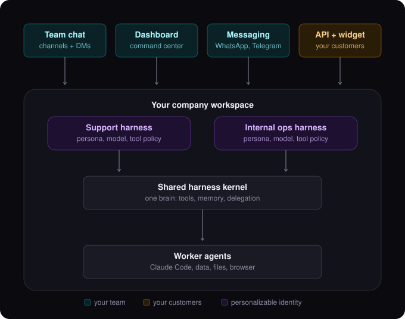

# Groovy

Groovy is a source-available AI agent platform for running personal and enterprise workflows with your own model provider credentials, local connector runtimes, memory, Datagran/data integrations, and self-hosted deployment options.

## Architecture at a glance

One brain, many faces, many rooms: every surface (team chat, dashboard, messaging, customer-facing API) talks to the same harness kernel through a personalizable harness profile, and the kernel delegates real work to agents.

<p align="center">
  
</p>

Groovy is **source-available, not open source**. Each tagged source release is
published to the public mirror from the same `source-v*` tag used by the private
release. The private repository remains the development source of truth and
unreleased commits remain private. Viewing, cloning, or forking the public
mirror does not grant production, commercial, internal business, hosted,
resale, sublicensing, or managed-service rights.

Use of Groovy requires a paid license unless Groovy has explicitly granted different written rights.

## Licensing

Groovy has two primary customer paths:

- **Groovy Personal**: yearly license for one individual using Groovy for personal, non-commercial projects.
- **Groovy Enterprise**: commercial license for companies that want source access, self-hosting, internal modification rights, support, and fallback rights to the last paid version.

Resale, sublicensing, third-party hosting, managed services, Groovy-powered customer services, and token-consumption billing require explicit written reseller or partner authorization.

Read:

- [LICENSE.md](LICENSE.md)
- [PERSONAL-LICENSE.md](PERSONAL-LICENSE.md)
- [COMMERCIAL-USE.md](COMMERCIAL-USE.md)
- [ENTERPRISE-LICENSE-SUMMARY.md](ENTERPRISE-LICENSE-SUMMARY.md)
- [RESELLER-TERMS-SUMMARY.md](RESELLER-TERMS-SUMMARY.md)

## Public Source And Forks

Yes, public GitHub repositories can be forked.

That does **not** mean forks are free to use. A fork of the public mirror is
allowed for evaluation, review, and contribution, but the license still
controls usage rights. Personal use requires Groovy Personal. A company,
client, team, revenue-generating project, hosted service, resale, or internal
business workflow requires the applicable Enterprise, reseller, or partner
rights.

The paid product is not GitHub access alone. Paid access includes license rights, account portal access, downloads, updates, source snapshots, support, enterprise terms, and renewal/fallback rights.

## Billing Model

Groovy does not charge a percentage over token usage by default.

Customers bring their own provider credentials, such as:

- OpenAI
- Anthropic
- Google Gemini
- Azure OpenAI
- AWS Bedrock
- Groq
- Mistral
- Datagran

Datagran is required when you want Groovy semantic Memory or Datagran-backed Data Integrations. Developers and enterprise customers who enable those features need a Datagran account and a `DATAGRAN_API_KEY`. Groovy also maintains a private structured Wiki for durable project, entity, preference, decision, and reusable-learning pages. The orchestrator can use either layer or both; `remember` syncs durable learnings to Datagran and the Wiki, while Wiki-only filing remains available for knowledge that does not need fuzzy semantic recall.

If Datagran is not configured, semantic `remember`/`recall` and Datagran integrations should be disabled or treated as unavailable. The private Wiki is a separate Supabase Storage-backed capability.

Token-consumption billing is only available for authorized enterprise resellers or partners whose license explicitly enables it.

## Two Setup Paths

Groovy has two different setup paths. They should not be confused.

### 1. Use Groovy

This is the normal path for personal users and most hosted users.

```text
Buy or receive a license -> sign in to the Groovy account portal -> download the current connector/source snapshot -> install the connector -> add provider keys -> run Groovy
```

Personal users do **not** need their own Vercel, Supabase, or Fly.io account just to use Groovy.

In the default personal path, Groovy-operated infrastructure powers the account portal, Stripe purchase flow, license activation/checks, device management, downloads/source-snapshot entitlement, and hosted relay/API services where needed. The user controls their local connector, local files, provider API keys, provider billing account, and optional Datagran account.

Groovy should not collect prompts, outputs, documents, workflows, local files, provider credentials, or business content by default.

### 2. Self-host or work from source

This is the developer and enterprise path.

```text
Get licensed source access -> choose infrastructure -> configure Vercel/Supabase/Fly or replacements -> set secrets -> deploy -> connect provider and Datagran accounts
```

This path is where the AI-agent CLI setup guide is useful.

## AI-Agent CLI Setup For Developers And Enterprise

Groovy includes a paste-ready setup guide for AI coding agents:

- [docs/ai-agent-setup.md](docs/ai-agent-setup.md)

Copy that document into Claude Code, Codex, Cursor, or another AI coding agent when setting up a developer checkout, self-hosted deployment, or enterprise environment. The agent will ask the operator for missing values and then run the Groovy CLI to configure the setup step by step.

The fastest way to get the setup prompt is:

```bash
npx @gogroovy/cli setup prompt
```

From this repo, you can also run:

```bash
npm run groovy -- setup prompt
```

The AI-agent setup flow covers local development, Vercel, Supabase, Fly.io, Stripe, provider API keys, Groovy license activation, Datagran Memory, Datagran-backed Data Integrations, and connector startup. Browser steps are only needed for account creation, OAuth, or provider dashboards that do not support full CLI setup.

## What Users Actually Install

Groovy has three user-facing pieces:

1. **Groovy account portal**
   Users sign in here after purchase or enterprise provisioning. The portal shows their license, renewal status, devices, billing, downloads, source snapshots, checksums, and release notes.

2. **Groovy source and downloads**
   Active personal and enterprise customers get current downloads and source snapshots through the portal and CLI. They do not need private GitHub access by default.

3. **Groovy Connector**
   The connector is the local runtime installed on the user's machine. It lets Groovy work with the user's browser, files, WhatsApp, terminal, and local tools with the user's permission.

Typical personal or hosted-user flow:

```text
Buy Groovy Personal -> create/login to account -> open account portal -> download current version/source -> install connector -> connect provider keys -> run Groovy
```

Typical developer or enterprise self-host flow:

```text
Contact sales -> sign agreement -> receive enterprise account/license -> download source snapshot and deployment packages -> self-host or install connector -> connect provider and Datagran accounts
```

## How Updates Work

Updates do not come from giving every customer direct access to the private GitHub repo.

The release flow is:

```text
private Groovy repo -> source-v* release tag -> public source mirror
                                         \----> portal/CLI snapshots and signed artifacts
```

Pushing the source tag publishes the reviewed release to the public mirror; it
does not publish every private `main` commit. When a user's license is active,
the portal and CLI can also show the packaged source and signed artifacts they
are entitled to download. If a personal license expires, the already-installed
version can continue for personal use, but the user loses the right to run
newer releases plus access to new portal downloads, activations, updates, and
support.

## Repository Roles

The private production repository is for:

- current product development
- Vercel deployment
- unreleased source
- release source snapshots
- internal release preparation

The release-synchronized public GitHub mirror is for:

- source code
- documentation
- issues
- pull requests
- security review
- developer evaluation

The separate private `groovy-releases` repository is for:

- signed connector installers
- headless connector tarballs
- checksums
- CI-produced release artifacts

GitHub is the public source and contribution surface, not the payment, license,
or signed-binary authority. The Groovy account portal and license system
control usage rights, device activation, packaged downloads, updates, and
enterprise entitlements. Current connector downloads should be served through
the portal with private storage and signed URLs.

## Contributing

Contributions are welcome, but contribution does not change the license terms.

Before contributing:

- Read [CONTRIBUTING.md](CONTRIBUTING.md).
- Do not include secrets, customer data, prompts, outputs, documents, credentials, or proprietary data.
- Keep changes focused.
- Include tests or verification notes for behavior changes.

Groovy may require a CLA or DCO before accepting contributions.

## Local Development

Install dependencies:

```bash
npm install
```

Run the web app:

```bash
npm run dev
```

Open:

```text
http://localhost:3000
```

Run the relay locally:

```bash
npm run relay
```

Run the local connector:

```bash
npm run connector -- --relay ws://localhost:8787 --pair YOUR-CODE
```

Run the Groovy CLI from source:

```bash
npm run groovy -- doctor --json --env-file .env.local
```

The publishable npm CLI package lives in:

```text
packages/groovy-cli
```

The intended public package name is:

```text
@gogroovy/cli
```

Publishing requires an npm account with access to the `@gogroovy` npm organization and a GitHub secret named `NPM_TOKEN`. The workflow is [Publish Groovy CLI to npm](.github/workflows/publish-cli-npm.yml).

## Required Infrastructure

Groovy currently uses:

- Vercel for the Next.js app
- Supabase for auth, database, RLS, and private storage
- Fly.io for the websocket relay
- Stripe for personal yearly subscriptions
- Datagran for Groovy Memory and Datagran-backed Data Integrations when those features are enabled
- npm for publishing the Groovy CLI package
- Private GitHub Releases or private artifact storage for connector release staging

See:

- [docs/reference-infrastructure.md](docs/reference-infrastructure.md)
- [docs/groovy-launch-readiness.md](docs/groovy-launch-readiness.md)
- [docs/github-source-workflow.md](docs/github-source-workflow.md)
- [docs/ai-agent-setup.md](docs/ai-agent-setup.md)
- [docs/groovy-licensing-distribution-plan.md](docs/groovy-licensing-distribution-plan.md)

## Security

Do not commit secrets.

Provider keys, license signing private keys, Stripe secrets, Supabase service role keys, relay secrets, and admin tokens must stay in server-side environment variables.

Read [SECURITY.md](SECURITY.md) before reporting vulnerabilities.
